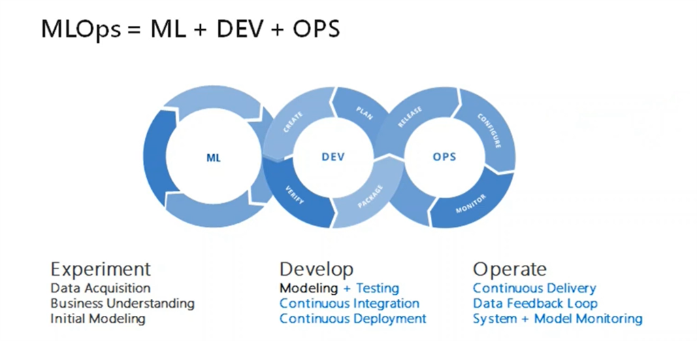
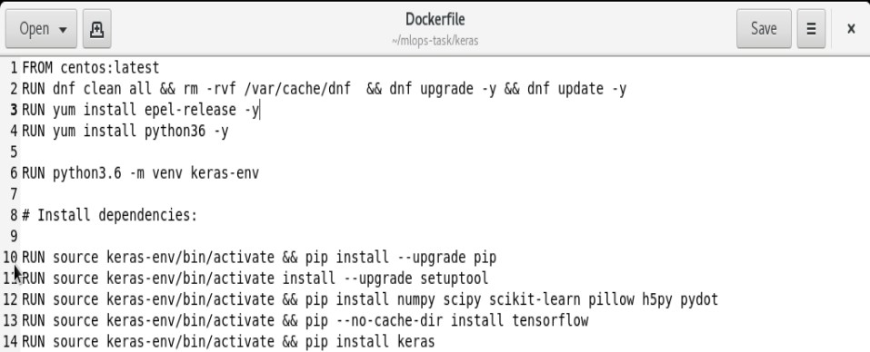
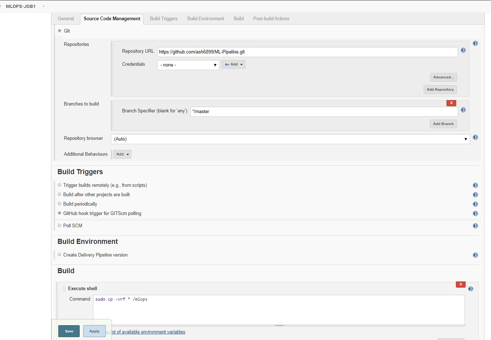
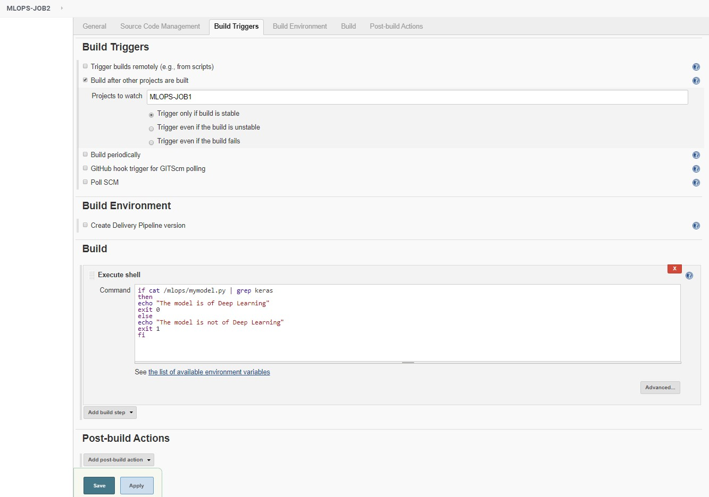
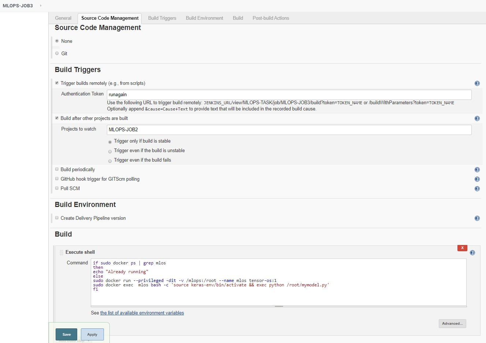
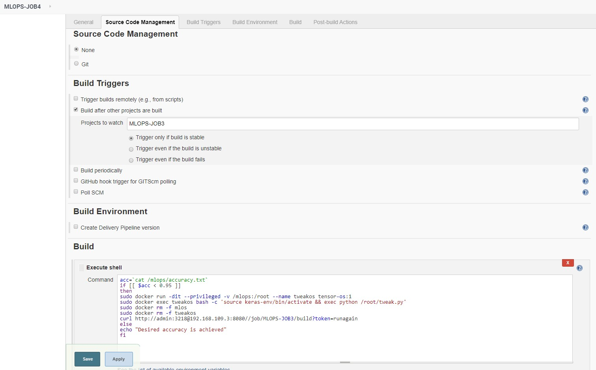
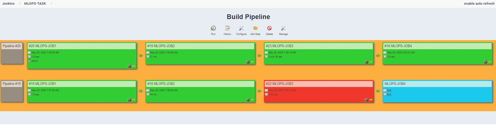

# Machine Learning - CI/CD Pipeline

## Task

**1. Create container image that’s has Python3 and Keras or numpy  installed  using dockerfile.**

**2. When we launch this image, it should automatically starts train the model in the container.**

**3. Create a job chain of job1, job2, job3, job4 and job5 using build pipeline plugin in Jenkins.**

**4.  Job1 : Pull  the Github repo automatically when some developers push repo to Github.**

**5.  Job2 : By looking at the code or program file, Jenkins should automatically start the respective machine learning software installed interpreter install image container to deploy code  and start training( eg. If code uses CNN, then Jenkins should start the container that has already installed all the softwares required for the cnn processing).**

**6. Job3 : Train your model and predict accuracy or metrics.**

**7. Job4 : if metrics accuracy is less than 95%  , then tweak the machine learning model architecture.**

**8. Job5: Retrain the model or notify that the best model is being created**

**So at last we get a build pipeline for our model.**

